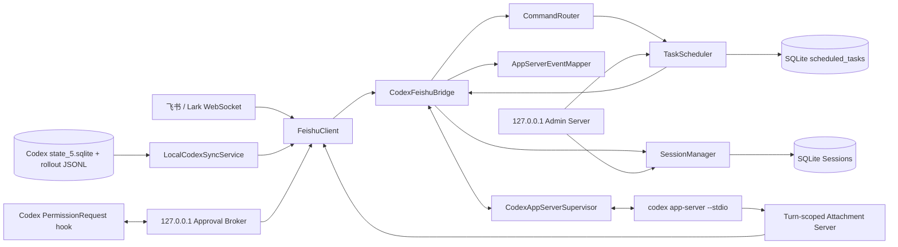

# codex-feishu

Codex 官方 App Server 的飞书/Lark 客户端。服务通过飞书 Bot WebSocket 接收消息，使用 `stdio` 上的 JSON-RPC/JSONL 长连接驱动 `codex app-server`，并把会话、流式文本、工具进度、审批请求和最终结果同步回飞书。

## 核心能力

- 飞书与 Lark WebSocket 长连接，支持文本、富文本、图片、文件、音频和视频。
- 群聊默认按“群 + 用户”隔离，支持每个对话保存、命名和切换多个 Codex Thread；服务重启后自动恢复。
- 支持 `thread/start`、`thread/resume`、`turn/start` 和 `turn/interrupt`。
- 500～1000ms 窗口内合并流式 delta，长回复按飞书限制自动分块。
- 同一张进度卡片原地展示 Shell、文件修改、MCP 等工具状态。
- 命令、文件、权限升级、MCP elicitation 和 `requestUserInput` 均可在飞书卡片中完成。
- Codex 可通过一次性能力令牌把工作区内生成的图片或文件安全回传到发起任务的飞书聊天。
- 支持会话级模型、推理强度、plan/default/full-auto 模式，以及持久化 Timer/Cron。
- 提供仅监听 `127.0.0.1` 的管理页、运行诊断和 macOS/Linux 用户服务文件生成。
- Typing Reaction 在任务开始时添加，在完成或失败时可靠清理。
- 同一聊天的消息顺序排队，不同聊天可并行执行。
- App Server 异常退出后按 1s、2s、5s、10s、30s 指数退避自动重启，并恢复持久化 Thread。
- JSON-RPC stdin 使用串行写入队列处理背压；单聊天等待队列默认最多 20 条。
- 审批按钮仅允许当前任务发起人操作，群聊中的其他成员不能代为批准。
- 可只读跟随 Codex Desktop/CLI 的本地 rollout，把用户输入和最终回答实时推送到飞书；通过官方 `PermissionRequest` hook 也可在飞书批准本地会话操作。

唯一 Agent 接口是 `codex app-server --stdio`。项目不依赖 Pi Agent、不使用 `codex exec`，也不控制 Codex Desktop UI。

## 新版架构



新版架构把协议、会话、调度、附件和运维拆成相互独立的服务，`CodexFeishuBridge` 只负责业务编排：

| 模块 | 责任 |
| --- | --- |
| `src/feishu/` | WebSocket、消息/卡片、Reaction、媒体下载与上传 |
| `src/app-server/` | Codex 子进程、JSON-RPC、Thread/Turn、事件映射和交互请求响应 |
| `src/bridge/` | 消息队列、Turn 生命周期、流式输出、审批归属和异常清理 |
| `src/session/` | 多会话、活动会话、运行偏好、历史、用量与 SQLite 迁移 |
| `src/codex-local/` | 只读 Codex `state_5.sqlite`、增量跟随 rollout、批准 hook 与回环 broker |
| `src/scheduler/` | Timer/Cron 持久化、原子领取、失败重试和重启恢复 |
| `src/attachments/` | 一次性能力令牌、回环发送端点、真实路径和文件大小校验 |
| `src/admin/` | 本机管理页、运行状态聚合、配置脱敏和写接口鉴权 |
| `src/workspace/` | 项目注册、真实路径白名单与管理员授权 |

一次普通消息的处理链如下：

1. `FeishuClient` 收到消息并下载其中的媒体资源。
2. Bridge 根据聊天类型和发送者计算 Conversation ID，将消息放入该 Conversation 的顺序队列。
3. `SessionManager` 恢复活动 Thread 或创建新 Thread，并把会话级模型、推理强度和运行模式应用到下一次 `turn/start`。
4. App Server 通知经 `AppServerEventMapper` 归一化后，Bridge 更新流式卡片、工具进度和最终结果。
5. App Server 发起审批、用户输入、权限或 MCP 请求时，Bridge 只允许当前 Turn 的发起人处理。
6. Turn 完成、失败、超时或服务停止时，统一清理 Typing、pending 请求、附件令牌和活动状态，再继续队列中的下一条消息。

## 会话与用户隔离

- 私聊使用 `chatId` 作为 Conversation ID。
- 群聊默认使用 `chatId:user:senderOpenId`，不同成员拥有独立上下文、队列、审批权和命名会话。
- 设置 `sessions.groupMode: "shared"` 后，同一群成员才会共享一个 Conversation。
- 一个 Conversation 可保存多个命名 Session，并通过 `active_sessions` 记录当前会话。
- 会话级 `model`、`reasoningEffort` 和 `mode` 保存在 `preferences_json`，切换或重启后仍会恢复。
- 旧版 `chat_sessions` 数据会幂等迁移到新版 `sessions` 表，旧表和旧数据不会删除。

### Codex 本地项目发现

项目发现默认以只读方式打开 `~/.codex/state_5.sqlite`，并执行 `PRAGMA query_only = ON`。读取器会先探测 `threads` 表的实际列，再查询未归档 Thread 的工作目录、标题、预览和更新时间，因此可以兼容缺少部分新字段的旧数据库。

```text
/project discover
        ↓ 只读 state_5.sqlite，按 cwd 聚合
/project use-local <序号>
        ↓ workspace.allowedRoots 真实路径校验
/session list
        ↓ 只读列出该 cwd 的 Thread
/session use <序号或Thread ID>
        ↓ App Server thread/read + thread/resume
```

本地数据库只用于“发现”。切换会话时仍由 Codex App Server 验证 Thread 状态并执行 `thread/resume`；代码不会修改、迁移或删除 Codex 自己的数据库和 JSONL 会话文件。如果数据库不存在、被占用或 schema 不兼容，`/session list` 会自动回退到 App Server 的 `thread/list`。

### 本地 Codex 会话实时同步与飞书批准

先在飞书绑定一个由 Codex Desktop/CLI 创建的 Thread，再显式开启同步：

```text
/session list
/session use <序号或Thread ID>
/session sync on
```

开启时游标从 rollout 文件末尾开始，因此不会把历史会话一次性刷入飞书。之后只同步 `user_message` 和 `phase=final_answer` 的 `agent_message`；推理、系统/开发者指令、工具参数和工具原始输出均不会推送。每个 Thread 的文件偏移保存在服务自己的 SQLite 中，重启后继续增量读取，且不会写入 Codex 的数据库或 JSONL。

要把本地 Codex 的批准请求送到飞书，服务启动后执行一次：

```bash
codex-feishu install-codex-hook --config /absolute/path/to/config.json
```

需要移除当前配置安装的 hook 时执行：

```bash
codex-feishu uninstall-codex-hook --config /absolute/path/to/config.json
```

该命令幂等合并 `~/.codex/hooks.json` 中的 `PermissionRequest` hook，不覆盖已有 hooks。Codex 首次发现新 hook 时可能要求确认信任。批准发生后，hook 通过仅监听 `127.0.0.1`、带随机 Bearer Token 的临时 broker 等待飞书卡片结果：

- “批准”或“拒绝”会直接把官方 hook 决策返回给正在等待的 Codex Desktop/CLI。
- “转到 Codex”会放弃 hook 决策，随后显示 Codex 原生批准界面。
- 服务未运行、Thread 未开启同步、卡片发送失败或等待超时时，自动返回空决策并回退 Codex 原生批准流程。
- 只有执行 `/session sync on` 的飞书用户可以操作对应批准卡片。

停止同步使用 `/session sync off`。此功能依赖带稳定 Hooks 功能的较新 Codex CLI；建议先运行 `codex features list` 确认 `hooks` 为 `stable`。

## 交互请求与附件回传

Bridge 会按照 Codex App Server 的不同 schema 返回对应结果，而不是把所有请求简化为同一种批准/拒绝响应：

- 命令和文件变更：返回 `decision`。
- `item/permissions/requestApproval`：批准时只授予本次请求中明确列出的网络或文件系统能力。
- `item/tool/requestUserInput`：支持选项、跳过、自由文本和多问题逐步回答。
- `mcpServer/elicitation/request`：支持表单、URL 和 OpenAI 表单类型。
- 服务退出或 App Server 故障时，所有未完成请求会自动拒绝或取消，避免 Codex 永久等待。

当 Codex 需要把生成物发送给用户时，Bridge 会为当前 Turn 注入一个本机附件命令和高熵能力令牌。发送端点仅监听 `127.0.0.1`，并同时校验令牌作用域、文件真实路径、工作区边界、普通文件类型和大小限制；Turn 结束后令牌立即失效。

## 定时任务与超时恢复

- `/timer` 创建一次性任务，Codex Turn 真正成功后才从数据库删除；入队、启动或执行失败都会进入重试。
- `/cron` 使用标准五字段表达式（分、时、日、月、周），支持列表、暂停、恢复和删除。
- 调度器通过 SQLite 原子把任务从 `active` 领取为 `running`，避免同一任务重叠提交。
- 失败任务按 `retryDelayMs` 重试，超过 `maxRetries` 后标记为 `failed`。
- 服务重启时遗留的 `running` 任务会恢复为待执行任务；错过执行时间的任务会在调度器启动后补交。
- Turn 达到 `runtime.turnDeadlineMs` 后先调用 `turn/interrupt`；宽限期后仍未结束时释放会话队列，下一条消息可以继续执行。

定时任务与普通飞书消息使用同一条 Conversation 队列，因此不会绕过会话隔离、运行偏好和审批规则。任务会记录创建时的 Thread；如果执行前切换了会话，任务会失败并提示先切回，避免在错误项目中运行。

## 环境要求

- Node.js 20 或更高版本
- 已安装并登录的 Codex CLI
- 可创建自建应用的飞书或 Lark 账号；也可以使用已有机器人凭证

支持 macOS、Linux 和 Windows。Windows 上建议使用 PowerShell，并确保 `codex --version` 可以正常运行；程序会自动解析 npm 安装产生的 `codex.cmd`，停止时会清理其完整子进程树。

## 安装与配置

### npm 全局安装

安装最新版本：

```bash
npm install -g codex-feishu-app-server@latest
```

也可以使用缩写：

```bash
npm i -g codex-feishu-app-server@latest
```

确认全局安装结果：

```bash
codex-feishu --version
```

输出示例：

```text
codex-feishu 0.1.0
```

也可以通过 npm 查看全局安装信息：

```bash
npm list -g codex-feishu-app-server --depth=0
```

进入需要作为默认工作区的项目目录后启动：

```bash
cd /absolute/path/to/project
codex-feishu
```

建议首次启动前确认 Codex CLI 已安装并完成登录：

```bash
codex --version
codex login status
```

更新到最新版本：

```bash
npm update -g codex-feishu-app-server
```

如果需要强制安装最新发布版本，也可以重新执行：

```bash
npm install -g codex-feishu-app-server@latest
```

卸载：

```bash
npm uninstall -g codex-feishu-app-server
```

### 从源码安装

```bash
git clone https://github.com/WJIAEN-K/codex-feishu.git
cd codex-feishu
npm install
```

项目只使用 JSON 配置，不读取 `.env` 或业务环境变量。默认配置文件为启动目录下的 `.codex-feishu/config.json`。第一次在交互式终端启动且文件不存在时，程序会生成默认配置并显示飞书配置链接和二维码；扫码后自动写入 App ID、App Secret 和扫码人的管理员 Open ID，然后继续启动。

从旧版本升级时，如果 JSON 尚未包含凭证，程序会一次性读取原有 `.env` 文件以及 `FEISHU_*`、`CODEX_*`、`LOG_LEVEL` 进程环境变量并生成 JSON，同时从旧 Session SQLite 的 `workspaces` 表导入项目列表。进程环境变量优先于 `.env`。迁移不会修改或删除旧文件、环境变量和数据库；JSON 生成后以 JSON 为准。

最小配置结构如下，首次扫码时会自动生成，不需要手工创建：

```json
{
  "version": 1,
  "feishu": {
    "appId": "cli_xxxxxxxxx",
    "appSecret": "xxxxxxxxx",
    "domain": "feishu",
    "adminOpenIds": ["ou_xxxxxxxxx"]
  },
  "codex": {
    "command": "codex",
    "args": ["app-server", "--stdio"],
    "requestTimeoutMs": 120000,
    "localDiscoveryEnabled": true,
    "localStateDatabasePath": "/Users/your-name/.codex/state_5.sqlite"
  },
  "workspace": {
    "defaultPath": "/absolute/path/to/project",
    "allowedRoots": ["/absolute/path/to/projects"],
    "projects": {
      "backend": {
        "path": "/absolute/path/to/projects/backend",
        "enabled": true,
        "createdBy": "config",
        "createdAt": 0
      }
    }
  },
  "storage": {
    "sessionDatabasePath": "/absolute/path/to/project/.codex-feishu/sessions.sqlite"
  },
  "queue": {
    "maxPerChat": 20
  },
  "attachments": { "enabled": true, "maxFileBytes": 52428800 },
  "sessions": { "groupMode": "per-user", "idleResetMs": 0 },
  "scheduler": {
    "enabled": true,
    "pollIntervalMs": 1000,
    "retryDelayMs": 60000,
    "maxRetries": 3
  },
  "localSync": {
    "enabled": true,
    "pollIntervalMs": 750,
    "approvalTimeoutMs": 300000
  },
  "admin": { "enabled": true, "port": 0 },
  "runtime": {
    "logLevel": "info",
    "turnDeadlineMs": 3600000,
    "turnInterruptGraceMs": 10000
  }
}
```

完整模板见 [codex-feishu.config.example.json](codex-feishu.config.example.json)。所有路径必须是绝对路径，`workspace.allowedRoots` 和 `workspace.projects` 中的目录必须已存在。项目别名会去除首尾空格并转换为小写，规范化后不能重复，且不能使用保留名称 `default`。`workspace.projects` 保存飞书 `/project add/remove` 管理的项目别名和路径；`workspace.allowedRoots` 是项目目录安全白名单，项目真实路径（包括符号链接解析结果）必须位于其中。`queue.maxPerChat` 控制单个聊天可等待的消息数。

`sessions.groupMode` 默认是 `per-user`，防止同一群内不同用户共享上下文或审批权限；只有明确需要公共上下文时才设置为 `shared`。`runtime.turnDeadlineMs` 为 `0` 时关闭 Turn 截止时间。管理端口为 `0` 时随机选择空闲端口；未配置 `admin.authToken` 时每次启动生成临时令牌，并在本机日志输出管理地址。

新增配置项：

| 配置 | 默认值 | 说明 |
| --- | ---: | --- |
| `attachments.enabled` | `true` | 是否允许 Codex 回传工作区内生成的文件 |
| `attachments.maxFileBytes` | `52428800` | 单个回传文件上限，单位字节 |
| `sessions.groupMode` | `per-user` | 群聊按用户隔离；可显式设置为 `shared` |
| `sessions.idleResetMs` | `0` | 空闲多久后自动创建新会话；`0` 表示关闭 |
| `scheduler.enabled` | `true` | 是否启用持久化 Timer/Cron |
| `scheduler.pollIntervalMs` | `1000` | 调度扫描间隔 |
| `scheduler.retryDelayMs` | `60000` | 失败后的重试间隔 |
| `scheduler.maxRetries` | `3` | 标记任务失败前的最大重试次数 |
| `admin.enabled` | `true` | 是否启动本机管理服务 |
| `admin.port` | `0` | 管理服务端口；`0` 表示随机空闲端口 |
| `admin.authToken` | 未设置 | 可固定管理 API 令牌；未设置时启动时生成 |
| `runtime.turnDeadlineMs` | `3600000` | 单个 Turn 最长运行时间；`0` 表示不限制 |
| `runtime.turnInterruptGraceMs` | `10000` | 软中断后的等待宽限期 |
| `codex.localDiscoveryEnabled` | `true` | 是否直接只读 Codex 本地数据库发现项目和会话 |
| `codex.localStateDatabasePath` | `~/.codex/state_5.sqlite` | Codex 本地 Thread 索引数据库的绝对路径 |
| `localSync.enabled` | `true` | 是否启用本地 rollout 增量同步与批准 broker |
| `localSync.pollIntervalMs` | `750` | 本地 rollout 增量检查间隔，最低 200ms |
| `localSync.approvalTimeoutMs` | `300000` | 飞书批准等待时间；超时后回退 Codex 原生批准 |

使用其他配置文件：

```bash
codex-feishu --config /absolute/path/to/config.json
# 或源码运行
npm start -- --config /absolute/path/to/config.json
```

配置文件使用原子写入并设置为 `0600`。运行期间每 500ms 检查内容变化：`workspace.projects` 变更会直接生效，其他有效配置变化会自动断开并重建 Feishu/Codex 内部服务，无需重启 Node 进程。无效 JSON 或不合法路径不会替换当前运行配置；新配置启动失败时自动恢复上一份有效 JSON 和运行实例。

Docker、systemd、CI 等非交互环境不会等待扫码，必须预先挂载包含飞书凭证的 JSON 配置文件。

## 启动

从 npm 包一键启动：

```bash
cd /absolute/path/to/project
npx --yes codex-feishu-app-server@latest
```

第一次运行会显示二维码，后续运行会复用本地凭证。

Windows PowerShell：

```powershell
cd C:\absolute\path\to\project
codex --version
npx --yes codex-feishu-app-server@latest
```

这里启动的是与 ChatGPT 账号登录状态兼容的本机 Codex App Server，不会通过 UI 自动化接管 ChatGPT 桌面端。Windows 新版 ChatGPT 中的 Codex 与 CLI 可以使用同一账号和本机会话存储，但飞书端仍通过官方 `codex app-server --stdio` 协议通信。

开发模式：

```bash
npm run dev
```

生产构建：

```bash
npm run build
npm start
```

运行诊断与生成用户服务文件：

```bash
codex-feishu doctor --config /absolute/path/to/config.json
codex-feishu install-service --config /absolute/path/to/config.json
```

`install-service` 只写入权限为 `0600` 的 launchd/systemd 用户服务文件并显示启用命令，不会自动启动服务。

## 本机管理与诊断

管理服务只绑定 `127.0.0.1`。启动日志会输出类似 `http://127.0.0.1:<port>/#token=<token>` 的本机地址。页面和 `/api/status` 可查看：

- Codex App Server 与飞书连接状态；
- 已注册项目、命名 Session 和持久化定时任务；
- 已脱敏的当前 JSON 配置。

管理页面会从 URL fragment 读取令牌并立即从地址栏移除。`/api/status` 和暂停、恢复、删除定时任务、切换活动 Session 等 `/api/actions/*` 请求都必须携带 `Authorization: Bearer <token>`。状态响应会隐藏 App Secret、Encrypt Key、Verification Token 和管理令牌。

`doctor` 不启动飞书机器人，会依次检查 Node.js 版本、Codex CLI、Codex 登录状态、默认工作区读写权限、SQLite 和飞书凭据配置；任一检查失败时命令返回非零退出码，适合部署前或服务异常时使用。

## 飞书命令

| 命令 | 说明 |
| --- | --- |
| `/new` | 在当前项目创建并切换到新的 Codex Thread |
| `/stop` | 通过 `turn/interrupt` 中断当前 Turn |
| `/status` | 查看 App Server、Session、Thread ID 和工作目录 |
| `/project list` | 查看已注册项目 |
| `/project current` | 查看当前项目和目录 |
| `/project discover` | 只读扫描 Codex 本地数据库中的项目和会话数量，仅管理员可用 |
| `/project use-local <序号>` | 切换到发现的本地项目，再通过 `/session list` 选择已有会话 |
| `/project use <别名>` | 切换项目并创建新 Thread |
| `/project add <别名> <绝对路径>` | 注册项目，仅管理员可用 |
| `/project remove <别名>` | 删除项目，仅管理员可用 |
| `/session current` | 查看当前 Thread、目录、绑定方式、模型和模式 |
| `/session saved` | 查看当前 Conversation 保存的命名会话 |
| `/session switch <名称或Thread ID>` | 切换到已保存会话 |
| `/session rename <新名称>` | 重命名当前会话 |
| `/session new [项目别名] --name <名称>` | 创建新的命名会话 |
| `/session list [项目别名]` | 列出本机已有 Codex 会话，仅管理员可用 |
| `/session use <序号或Thread ID>` | 绑定已有 Codex Thread，仅管理员可用 |
| `/session sync on\|off\|status` | 开关本地会话正文同步和飞书批准路由，仅管理员可用 |
| `/history [数量]` | 读取当前 Thread 最近完整消息，数量默认 10、最大 50 |
| `/usage` | 查看 Codex 账号累计 Token、单日峰值和主要额度窗口 |
| `/model` 或 `/model list` | 查看当前模型和 App Server 返回的可用模型 |
| `/model <模型ID>` / `/model default` | 设置当前会话模型或恢复 Codex 默认值 |
| `/reasoning <none\|minimal\|low\|medium\|high\|xhigh\|ultra\|default>` | 设置当前会话推理强度 |
| `/mode <default\|plan\|full-auto>` | 设置运行与审批模式；`full-auto` 仅管理员可用 |
| `/timer <10s\|5m\|2h\|1d> <任务>` | 创建一次性定时任务 |
| `/timer list` / `/timer remove <ID>` | 查看或删除当前 Conversation 的定时任务 |
| `/cron add <分 时 日 月 周> <任务>` | 创建五字段 Cron 任务 |
| `/cron list` / `/cron pause\|resume\|remove <ID>` | 管理当前 Conversation 的 Cron 任务 |
| `/help` | 显示命令说明 |

运行模式映射：

| 模式 | Sandbox | Approval policy | 说明 |
| --- | --- | --- | --- |
| `default` | `workspace-write` | `on-request` | 默认开发模式 |
| `plan` | `read-only` | `on-request` | 启用 Codex plan collaboration mode；未选模型时自动使用模型目录中的默认模型 |
| `full-auto` | `workspace-write` | `never` | 关闭逐项审批但不扩大到 `danger-full-access`，仅管理员可启用 |

切换项目会创建新的 Thread，避免把不同代码库的上下文混在一起。查看或绑定已有会话仅允许 `feishu.adminOpenIds` 中的用户操作；绑定时还要求该 Thread 位于当前 App Server 可访问的本地 Codex 会话存储中，并且其工作目录位于 `workspace.allowedRoots`。同一 Thread 同时只能绑定一个飞书聊天。

## 验证

```bash
npm run typecheck
npm test
npm run build
npm audit
```

验证真实 App Server 的初始化和 `thread/start`：

```bash
npm run verify:app-server
```

Codex 升级后可按已安装版本重新生成官方 App Server TypeScript schema，用于协议差异核对：

```bash
npm run generate:app-server-types
```

额外启动一个只回复 `PONG`、不调用工具的真实 Turn：

```bash
npm run verify:app-server -- --turn
```

如果 Codex 不在 `PATH`，可以把可执行文件路径作为最后一个参数传入。

更多架构和测试说明见 [DEVELOPMENT.md](DEVELOPMENT.md)。

## 安全边界

- Codex 以普通用户、`workspace-write` sandbox 和 `on-request` 审批策略运行。
- `plan` 使用只读沙箱；`full-auto` 仍限制在 `workspace-write`，仅管理员能关闭逐项审批。本项目不提供远程开启 `danger-full-access` 的命令。
- App Server stdin/stdout 不暴露到网络，也不使用实验性 WebSocket 传输。
- JSON 配置、SQLite 数据库和媒体临时文件不进入 Git。
- 扫码取得的 App Secret 只写入权限为 `0600` 的 JSON 配置文件，不在终端输出。
- 飞书项目目录受 `workspace.allowedRoots` 白名单约束，项目增删受 `feishu.adminOpenIds` 控制。
- Codex 本地数据库只使用 `readonly` 和 `query_only` 连接；发现的项目仍须通过 `workspace.allowedRoots` 校验，项目路径和会话列表仅管理员可查看。
- rollout 同步只解析用户输入和最终回答；批准 broker 仅监听回环地址，运行态令牌文件权限为 `0600`，服务停止即删除。
- 单个飞书入站媒体文件在流式下载过程中限制为 25 MiB；临时目录权限为 `0700`、文件权限为 `0600`，Turn 结束即删除。
- Agent 回传只接受活动 Turn 的高熵一次性令牌、工作区内绝对真实路径和普通文件；符号链接越界、目录和超限文件都会拒绝。
- 管理服务只监听回环地址，配置响应会脱敏所有凭据，所有管理 API 都必须使用 Bearer Token。
- 定时任务记录创建者和创建时 Thread，普通用户只能修改自己创建的任务，切换会话后不会误在其他项目执行。
- 依赖通过 `npm audit` 审计；飞书 SDK 的易受攻击传递依赖被 overrides 固定到修复版本。

## License

MIT
